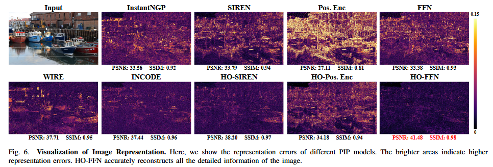
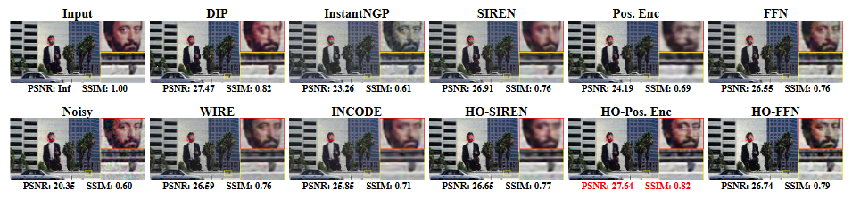

# HOPE: Enhanced Position Image Priors via High-Order Implicit Representations

This repository contains the official implementation and resources for the paper **“HOPE: Enhanced Position Image Priors via High-Order Implicit Representations.”**
HOPE introduces **High-Order Interaction Blocks** into implicit neural representations (INR), significantly reducing spectral bias and enabling superior performance across inverse imaging tasks such as  **denoising, super-resolution, CT reconstruction, inpainting, and signal representation** .

## Overview

HOPE expands the representational capacity of positional-encoding priors by incorporating **high-order feature interactions** within MLP-based implicit models.
Compared to DIP and traditional PIP, HOPE:

* Learns high-frequency components more effectively
* Exhibits stronger NTK diagonal behavior
* Achieves higher PSNR/SSIM across diverse tasks
* Maintains low parameter count and computational efficiency
  

## Features

* High-Order Interaction Block (HO Block)
* Support for Positional Encoding, Fourier Features, and SIREN variants
* Unified framework for multiple inverse problems
* Extensive benchmarks in image/audio/volume representation

## Result

### Image Represention



### Image Denoise



## Repository Structure

```
-POLY-PIP
        visualisation_audio.ipynb
        visualisation_denoise.ipynb
        visualisation_reconstruction.ipynb
        visualisation_represention.ipynb
```

## Usage

```bash
git clone https://github.com/<your-name>/HOPE
cd HOPE
pip install -r requirements.txt
```

## Citation

If you use HOPE in your research, please cite the original paper:

```
@article{0HOPE,
  title={HOPE: Enhanced Position Image Priors via High-Order Implicit Representations},
  author={ Chen, Yang  and  Wu, Ruituo  and  Hou, Junhui  and  Zhu, Ce  and  Liu, Yipeng },
  journal={IEEE Transactions on Image Processing},
  volume={34},
}

```

## License

MIT License.
